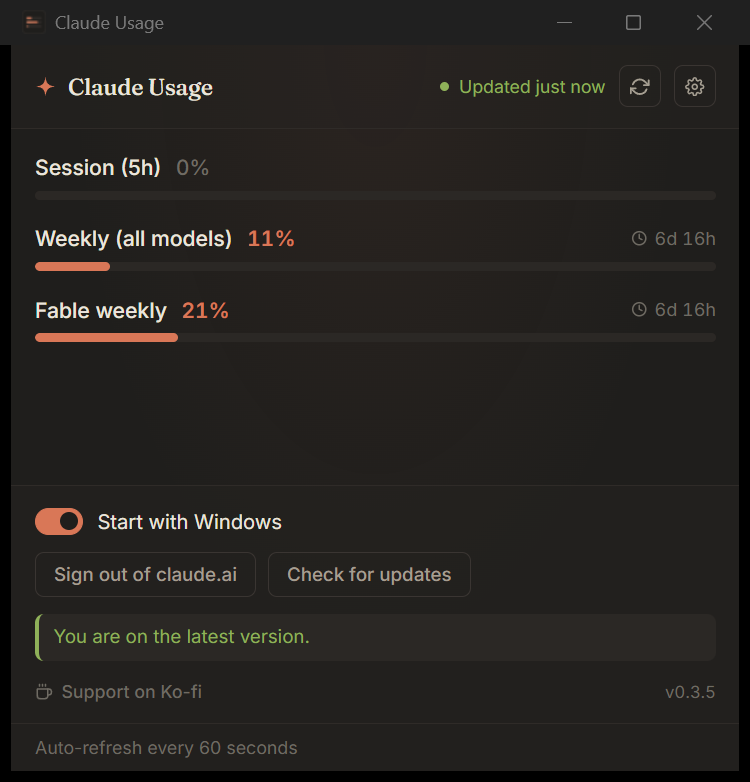

# Claude Usage

[English](../README.md) | [한국어](README.ko.md) | [简体中文](README.zh-CN.md)

<div align="center">


[](https://www.microsoft.com/windows)
[](https://tauri.app)
[](https://www.rust-lang.org)
[](../LICENSE)
[](https://github.com/HanChangHun/claude-usage/releases/latest)
[](https://github.com/HanChangHun/claude-usage/releases)

**实时显示 Claude.ai 配额 — 常驻 Windows 桌面。**

如果它帮你省下了几次配额查询,欢迎点个 GitHub Star,让更多 Claude 用户发现它。

[功能](#-功能) • [安装](#-安装-windows) • [工作原理](#-工作原理) • [隐私](#-隐私与安全) • [构建](#-从源码构建)

</div>

---



## ✨ 功能

### 🎯 核心

- **📊 实时配额显示** — 一眼掌握 claude.ai 报告的所有限额：会话(5 小时)、全模型每周限额、按模型的每周限额(Opus、Sonnet、Fable 等 — 新模型自动显示),以及额外使用量余额。
- **⏱️ 60 秒自动刷新** — 后台循环每分钟轮询一次配额,每个限额旁边显示重置倒计时。
- **🪟 紧凑的 440×420 窗口** — 简洁的深色小工具,不会占据桌面空间。
- **🎯 系统托盘** — 左键点击打开窗口,右键点击显示菜单。关闭窗口时隐藏到托盘,程序不退出。
- **📦 轻量** — MSI 约 5 MB,运行时内存约 50 MB。

### ⚙️ 设置面板

右上角齿轮图标:

- **🚀 开机自启** — 切换自动启动;登录后静静驻留托盘。
- **🔓 退出 claude.ai** — 清除内嵌 WebView 会话,重新提示登录。
- **🔄 检查更新** — 手动触发;否则启动时自动检查。
- **☕ Ko-fi 赞助** — 如果这个小工具帮你省了时间,欢迎[请开发者喝杯咖啡](https://ko-fi.com/edgetpu)。

### 🛡️ 安全自动更新

- **🔐 Ed25519 签名验证** — 每次更新在安装前都通过内嵌公钥验证签名。私钥永不离开维护者的机器。
- **📥 仅 GitHub Releases** — 更新器只与一个端点通信。
- **🎯 静默安装** — 首次 MSI 安装后,后续版本在下次启动时自动应用 — 无需重新安装。

---

## ⬇️ 安装 (Windows)

1. 从 [Releases](https://github.com/HanChangHun/claude-usage/releases/latest) 下载最新 **MSI**。
2. 双击 → **更多信息 → 仍要运行**(由于二进制文件未代码签名,Windows SmartScreen 会发出警告)。
3. 完成。托盘中会出现小工具;按提示登录 claude.ai 一次即可。

> 这一次性安装之后,每个新版本都会通过应用内更新器自动应用。

---

## 🔧 工作原理

Claude.ai 内部有一个用于其侧边栏配额小工具的接口:

```
GET https://claude.ai/api/organizations/<org_id>/usage
```

只有已登录 `claude.ai` 的浏览器标签页才能调用它(同源 + 会话 Cookie)。桌面应用内嵌了一个**隐藏的 WebView2 窗口**指向 claude.ai — 你也在这里完成一次性登录。应用内的 Rust 循环:

1. 每 60 秒从内嵌 WebView 读取 Cookie(`Webview::cookies_for_url`),
2. 提取 `lastActiveOrg` Cookie 值,
3. 使用 `reqwest` 调用 `/usage` 端点,附带所有会话 Cookie,
4. 通过 Tauri 事件发送 JSON 响应,
5. 主窗口订阅事件并重新渲染小工具。

如果 Cookie 过期(连续两次失败),应用会显示内嵌 WebView 让你重新登录。

**技术栈**:Tauri 2 + Rust + WebView2 (系统) + 轻量级原生 JS 前端。

---

## 🔒 隐私与安全

- 🏠 **仅本地** — claude.ai 会话 Cookie 仅保留在内嵌 WebView 中(与 claude.ai 的普通浏览器标签页处于相同的信任边界)。
- 🎯 **单一端点** — 应用唯一发出的网络请求,与 claude.ai 自身调用的 `/api/organizations/<org>/usage` 完全相同。
- 🔐 **签名更新** — 自动更新器只与 GitHub Releases 通信,应用任何二进制文件前都验证签名。
- 🚫 **无遥测** — 无分析、无第三方服务、无追踪。
- 📖 **开源** — 所有代码完全公开,可自由审计。

---

## 🛠 从源码构建

```bash
git clone https://github.com/HanChangHun/claude-usage
cd claude-usage/app
npm install
npm run tauri dev          # 开发模式
npm run tauri build        # 发布 MSI (src-tauri/target/release/bundle/msi/)
```

需要 Rust 1.95+、Node 20+、Visual Studio Build Tools 2022 的 **使用 C++ 的桌面开发** 工作负载。

### 制作签名发布版本

```powershell
# 一次性设置
cp app/.env.example app/.env   # 然后编辑 app/.env 填入你的密钥路径和密码

# 每次发布(先更新版本号 — 参见 CLAUDE.md 中的 4 个文件)
cd app
.\release.ps1 -Notes "本次发布的变更内容"
```

`release.ps1` 读取 `app/.env`(已 gitignore),运行 `tauri build`,将签名后的 MSI + `.msi.sig` 复制到 `app/installers/`,并自动生成 `app/installers/latest.json`(含签名)。将 MSI、`.msi.sig` 和 `latest.json` 三个文件上传到对应版本标签的 GitHub release。完整步骤参见 [CLAUDE.md](../CLAUDE.md#releasing)。

---

## 📝 许可证

MIT © 2026 Han Changhun
